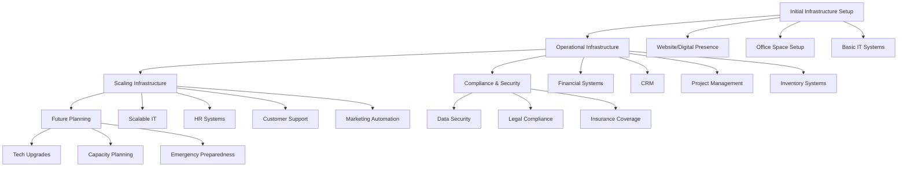

Determining the timelines for when infrastructure elements need to be in place depends heavily on the specific nature of your business, growth plans, and operational requirements. Here’s a general framework to consider:

### 1. Initial Infrastructure Setup

Website and Digital Presence: Ideally, this should be set up before or immediately after launching your business.

<!-- Unsupported block type: to_do -->

<!-- Unsupported block type: to_do -->

### 2. Operational Infrastructure

<!-- Unsupported block type: to_do -->

<!-- Unsupported block type: to_do -->

<!-- Unsupported block type: to_do -->

<!-- Unsupported block type: to_do -->

### 3. Scaling Infrastructure

<!-- Unsupported block type: to_do -->

<!-- Unsupported block type: to_do -->

<!-- Unsupported block type: to_do -->

<!-- Unsupported block type: to_do -->

### 4. Compliance and Security

<!-- Unsupported block type: to_do -->

<!-- Unsupported block type: to_do -->

<!-- Unsupported block type: to_do -->

### 5. Future Planning and Flexibility

<!-- Unsupported block type: to_do -->

<!-- Unsupported block type: to_do -->

<!-- Unsupported block type: to_do -->

### Timeline Considerations:

- Short-term (0-6 months): Focus on immediate needs like setting up basic infrastructure and operational systems.

- Medium-term (6-12 months): Implement scalable solutions and optimize existing infrastructure to support growth.

- Long-term (12+ months): Plan for future expansions, upgrades, and enhancements based on business growth projections.

Setting clear timelines and priorities for infrastructure helps businesses build strong foundations that support operations, growth, and resilience. To keep infrastructure running smoothly and effectively, companies should regularly review and adjust their systems based on changing needs and market conditions.

Regular infrastructure audits, including assessments of both technical and operational components, can help identify potential gaps or inefficiencies before they impact business performance. This proactive approach to infrastructure management ensures that resources are allocated effectively and systems remain aligned with business objectives. The key is to maintain flexibility while building robust, scalable solutions that can adapt to evolving business requirements.

To support this flexibility and adaptability, organizations should establish clear governance frameworks and decision-making processes around infrastructure changes. This ensures that modifications and upgrades are implemented strategically and align with both immediate operational needs and long-term business goals. Regular stakeholder communication and feedback loops are also essential for maintaining an infrastructure that truly serves the organization's evolving requirements.

<!-- Unsupported block type: child_database -->

This organized overview provides a clear roadmap for infrastructure implementation, helping to ensure that all essential components are addressed in a strategic and timely manner. Regular reviews and updates of this framework will help maintain alignment with business objectives and changing market conditions.

Consider using project management tools to track the implementation progress of each infrastructure component. This will help ensure deadlines are met and resources are allocated effectively.

