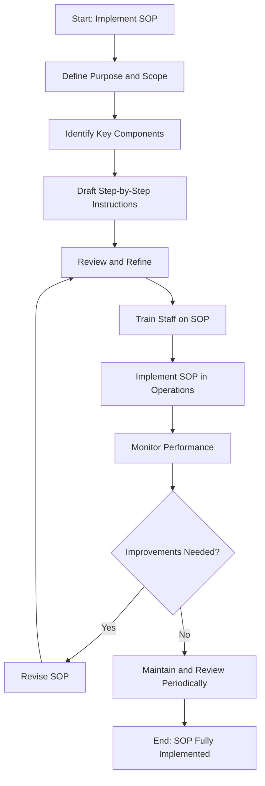

<!-- Unsupported block type: callout -->

<!-- Unsupported block type: column_list -->

```mermaid
graph TD
    A["Start: Implement SOP"] --> B["Define Purpose and Scope"]
    B --> C["Identify Key Components"]
    C --> D["Draft Step-by-Step Instructions"]
    D --> E["Review and Refine"]
    E --> F["Train Staff on SOP"]
    F --> G["Implement SOP in Operations"]
    G --> H["Monitor Performance"]
    H --> I{"Improvements Needed?"}
    I -- Yes --> J["Revise SOP"]
    J --> E
    I -- No --> K["Maintain and Review Periodically"]
    K --> L["End: SOP Fully Implemented"]

%% This flowchart outlines the process of creating and implementing a Standard Operating Procedure (SOP)
```

# Related Resources

- 