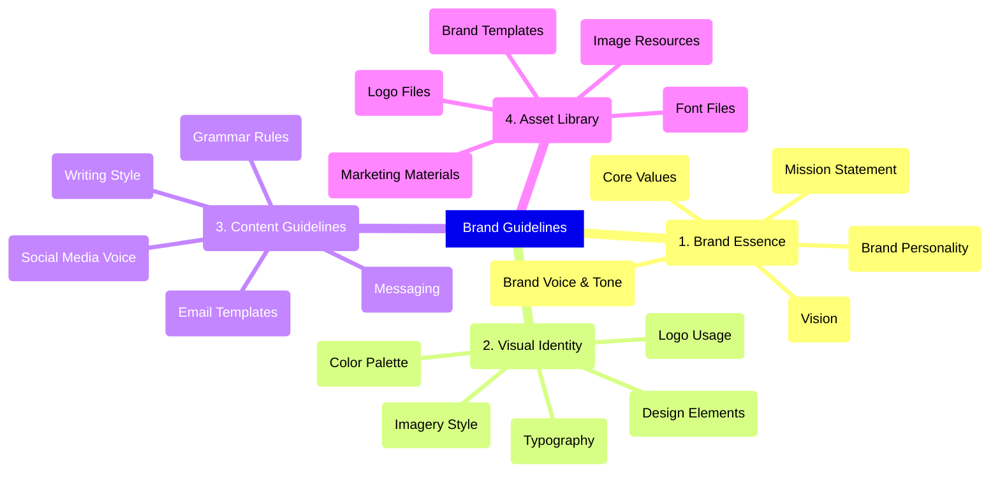

<!-- Unsupported block type: table_of_contents -->

## 1. Brand Essence

### Mission Statement

<!-- Unsupported block type: synced_block -->

### Vision

<!-- Unsupported block type: synced_block -->

### Core Values

<!-- Unsupported block type: child_database -->

Value Proposition

<!-- Unsupported block type: synced_block -->

### Brand Personality

### Brand Voice & Tone

<!-- Unsupported block type: child_database -->

## 2. Visual Identity

### Logo Usage & Variations
Colour Palette (with hex codes)
Typography
Imagery Style
Design Elements

<!-- Unsupported block type: child_database -->

## 4. Asset Library

### Logo Files
Brand Templates
Image Resources
Font Files
Marketing Materials

Remember to:
• Keep content organized and easy to navigate
• Include visual examples where possible
• Update regularly as brand evolves
• Add links to relevant resources
• Document any brand updates

<!-- Unsupported block type: child_page -->

<!-- Unsupported block type: child_page -->

<!-- Unsupported block type: child_page -->

<!-- Unsupported block type: child_database -->

<!-- Unsupported block type: child_database -->

# Brand Strategy

<!-- Unsupported block type: divider -->

<!-- Unsupported block type: toggle -->

<!-- Unsupported block type: divider -->

<!-- Unsupported block type: toggle -->

<!-- Unsupported block type: divider -->

<!-- Unsupported block type: toggle -->

<!-- Unsupported block type: divider -->

<!-- Unsupported block type: toggle -->

<!-- Unsupported block type: divider -->

<!-- Unsupported block type: toggle -->

<!-- Unsupported block type: divider -->

<!-- Unsupported block type: toggle -->

<!-- Unsupported block type: divider -->

<!-- Unsupported block type: toggle -->

<!-- Unsupported block type: divider -->

<!-- Unsupported block type: toggle -->

<!-- Unsupported block type: divider -->

# Brand Design

## Logos and Logo Variation

<!-- Unsupported block type: divider -->

<!-- Unsupported block type: toggle -->

<!-- Unsupported block type: divider -->

<!-- Unsupported block type: toggle -->

<!-- Unsupported block type: divider -->

<!-- Unsupported block type: column_list -->

## Typography

<!-- Unsupported block type: divider -->

<!-- Unsupported block type: toggle -->

<!-- Unsupported block type: divider -->

<!-- Unsupported block type: column_list -->

## Color Palette

<!-- Unsupported block type: divider -->

<!-- Unsupported block type: toggle -->

<!-- Unsupported block type: divider -->

<!-- Unsupported block type: callout -->

## Image Style and Photography

<!-- Unsupported block type: divider -->

<!-- Unsupported block type: toggle -->

<!-- Unsupported block type: divider -->

<!-- Unsupported block type: callout -->

## All Brand Assets

<!-- Unsupported block type: divider -->

<!-- Unsupported block type: callout -->

<!-- Unsupported block type: callout -->

<!-- Unsupported block type: callout -->

<!-- Unsupported block type: divider -->

<!-- Unsupported block type: toggle -->