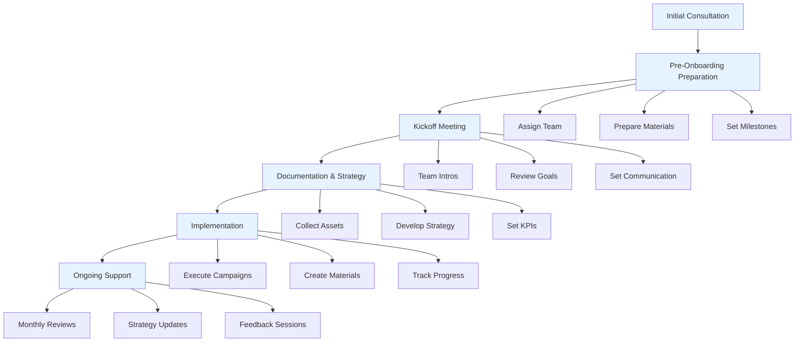

<!-- Unsupported block type: column_list -->

<!-- Unsupported block type: divider -->

<!-- Unsupported block type: column_list -->

# Customer Onboarding Flow

## 1. Initial Consultation

Understanding client needs, discussing business goals, values, and vision for sustainability in the space industry.

## 2. Pre-Onboarding Preparation

- Assign dedicated project manager and team members

- Prepare welcome materials with mission, values, and team introductions

- Set up 90-day milestone planning

## 3. Kickoff Meeting

- Team introductions and roles

- Review project goals and objectives

- Establish communication channels and expectations

- Timeline and milestone discussion

## 4. Documentation & Strategy

- Collect necessary assets and permissions

- Develop tailored marketing strategy

- Create campaign objectives and KPIs

- Present strategy for client review

## 5. Implementation

- Execute eco-friendly digital campaigns

- Create sustainable branding materials

- Regular progress tracking and reporting

## 6. Ongoing Support

- Monthly check-ins and performance reviews

- Strategy optimization based on feedback

- Regular client surveys and feedback sessions

<!-- Unsupported block type: callout -->

